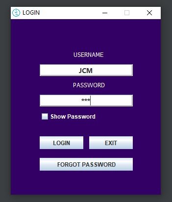
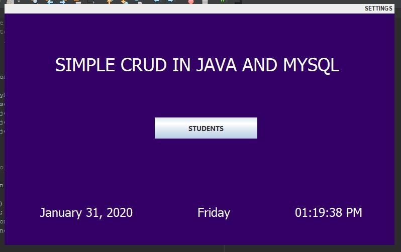
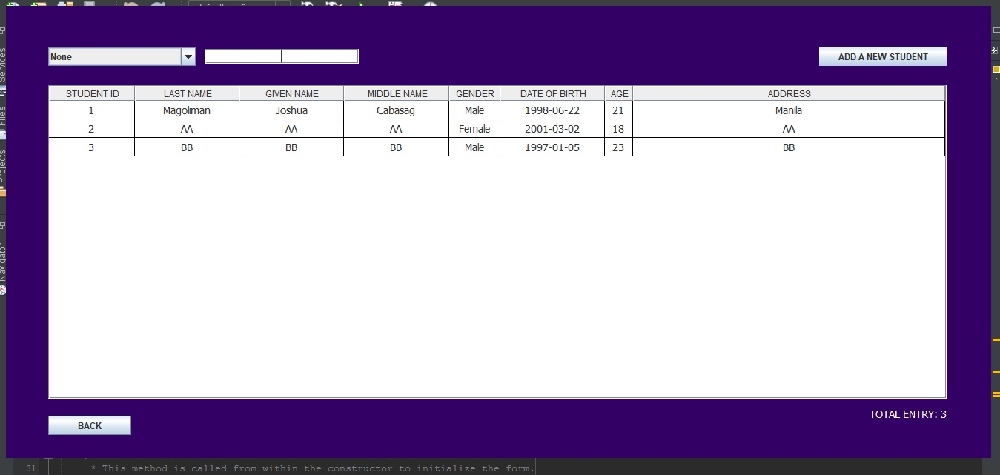
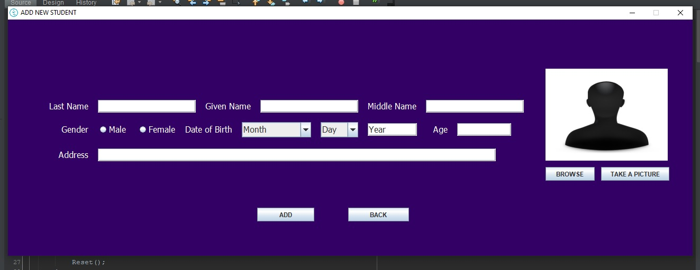
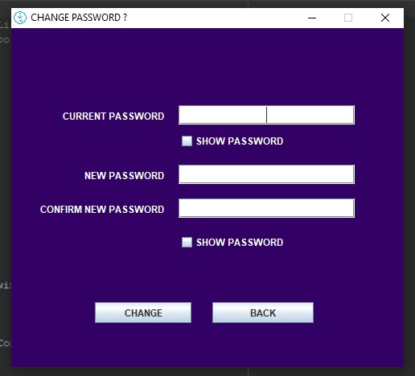
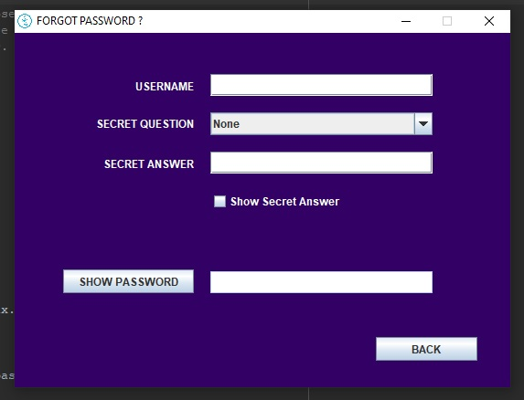
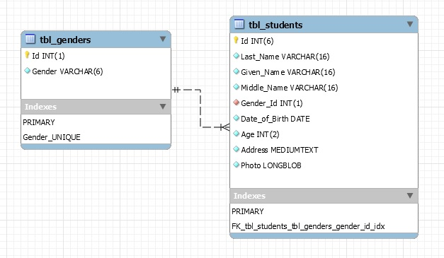

# MY SIMPLE CRUD IN JAVA AND MYSQL

* Purpose: My Project
* Programming Language: Java
* Version: Java SE 8
* IDE: NetBeans 8.2
* Backend Database: MySQL
* MySQL GUI Tool: MySQL Workbench
* Type of Application: Desktop Application (Java Application)
  
<h2> User Interface Screenshots </h2> 
  
  
  
  
  
  
  
  
  
	
  
	  
  
				  
  
  
  
  
<h2> Database Design Screenshot </h2> 
  
  